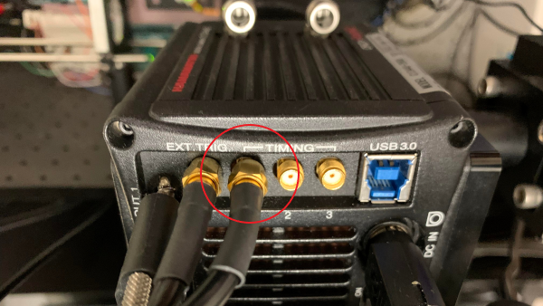
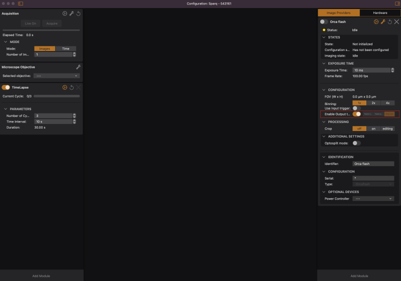
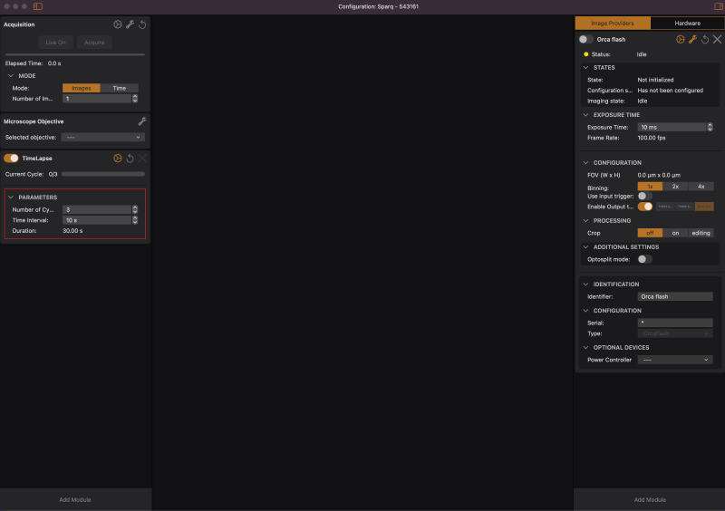
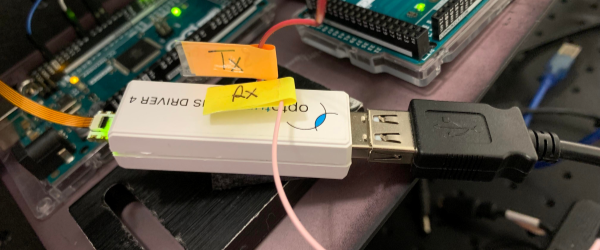
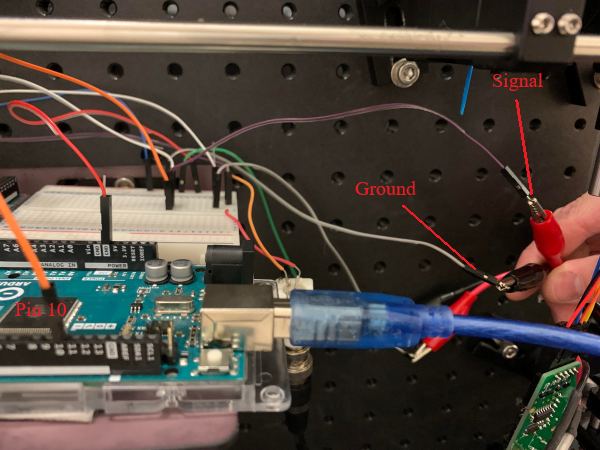
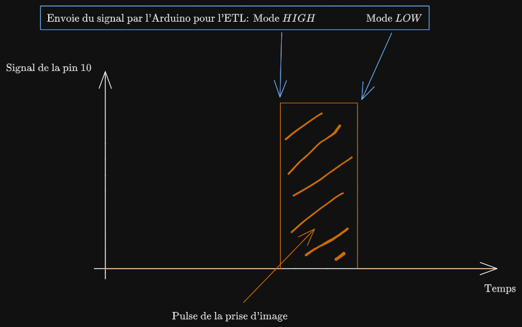

# Présence en laboratoire le 5 mai

## Expérience 1

## But principal

___

Le but des manipulations étaient de régler un problème majeur au montage pour permettre de réaliser de l'imagerie HiLo. Lorsque l'on prenait une image d'un certain plan avec la caméra, il nous était impossible de changer de plan focal avec une *Electric Tunable Lens* (ETL) à la suite de la prise d'image avec notre caméra. Il fallait donc permettre à l'ETL de savoir que lorsqu'une image était prise par la caméra, l'ETL pouvait modifier sa focale selon un courant prédéterminer pour changer de plan et donc réaliser de l'imagerie volumétrique. En bref, il fallait synchroniser la prise d'image avec le changement de focale de l'ETL par le biais d'un Arduino sur lequel les deux appareils seront reliés.

## Matériel

___

- La caméra utilisée est la ORCAFlash4.0 V3 - C13440-20CU, une caméra digitale CMOS de *Hamamatsu*. Les notes techniques sont disponibles [ici](https://www.hamamatsu.com/content/dam/hamamatsu-photonics/sites/documents/99_SALES_LIBRARY/sys/SCAS0134E_C13440-20CU_tec.pdf) et le manuel d'instruction [ici](https://seltokphotonics.com/upload/iblock/d68/d6870f763aa81b7b8f2c0853b7e20782.pdf)

- Le logiciel qui permet de contrôler la prise d'image et les différents paramètres de la caméra est: *NirvanaS* (2.4.1 (à vérifier)). Les différentes fenêtres et options qui seront utiles dans cette expérience sont expliquées dans un guide pour l'utilisation du microscope HiLo disponible [ici](fakelien.com).

- La lentille électrique permettant le changement de focale (ETL) est la EL-16-40-TC-VIS-5D de *Optotune*.

- Le driver pour relier l'ETL au Arduino, le Electrical Lens Driver 4, dont la documentation est disponible [ici](https://static1.squarespace.com/static/5d9dde8d550f0a5f20b60b6a/t/63cfdb005b3c212d742d60f8/1674566414045/Optotune+Lens+Driver+4+manual.pdf).

- Le Arduino utilisé dans cette expérience est le *Arduino MEGA 2560*.

- Deux codes seront utilisés durant cette expérience et envoyés au Arduino. Un code pour envoyer une seule et même commande *OneCommandAtATime.ino* et un code pour envoyer différentes commandes *LoopCommandInHiLoSetup.ino*. Il sont tout deux disponibles [ici](https://github.com/DCC-Lab/HiLoZebrafish/tree/master/ArduinoCodeForETL).

- Un oscilloscope pour permettre de visualiser un signal, n'importe quel fait l'affaire. Dans notre cas, le signal à capter est de 3.3V, alors simplement ajuster les graduations en conséquences. Aussi, l'échelle de temps de l'oscillo devrait être d'au moins 1 seconde par graduation.

- Un laser pour permettre la fluorescence et donc la possibilité de visionnement d'image. On utilise le *Cobolt* 06-MLD 488nm de *HÜBNER Photonics*. La *data sheet* est disponible [ici](https://hubner-photonics.com/wp-content/uploads/2014/11/D0352-O-Datasheet-Cobolt-06-01-Series.pdf) et l'explication de son utilisation avec notre système optique ce trouve [ici](fakelien.com).

## Méthode

___

Cette expérience sera divisée en trois étapes distinctes:

- $(1)$ **Premièrement**: Voir si le output de la caméra *external trigger* (voir plus bas) envoi bien un signal suite à la prise d'une image. Ce signal pourra alors être utilisé pour signaler à l'ETL de changer de focale.

- $(2)$ **Deuxièmement**: Prendre ce signal et l'envoyer à l'Arduino pour qu'il l'utilise comme annonce de changement de focal de l'ETL. Il pourra alors choisir un courant prédéterminé à envoyer à l'ETL qui changera sa focale en fonction de cette valeur de courant.

- $(3)$ **Finalement**: Faire un test complet du système pour voir si les trois appareils sont en bonne sychronisation et que chacun d'eux travail en harmonie durant la prise d'image. Pour cette fois, on imagera une lame de calibration déposée sur un *post-it* de couleur vert, mais n'importe qu'elle chose aurait fonctionné.

## Déroulement

___
Étape $(1)$:

- Branchement des différents appareils utilisés:

  - On branche un cable coaxial à l'entrée *External Trigger Timing* de la caméra (voir l'image ci-dessous) et on relie ce cable à l'entrée *Channel 1* de l'oscilloscope, en s'assurant que c'est ce canal qui est montré sur l'écran.

    
  
- Setup logiciel:

  - Pour la caméra et l'oscilloscope il suffit simplement ne pas oublier de les allumer et que l'oscilloscope affiche bien le *Channel 1* à l'écran.

  - Pour le logiciel Nirvana, la processus d'ouverture et les paramètres de base à avoir sont expliqués dans le guide d'utilisation de HiLo montré dans la section **Matériel**. Les seules différences sont:

    - On doit allumer le bouton *Output Trigger*, situé dans le module de la caméra *OrcaFlash*.

      

    - La section *TimeLapse* permet de prendre le nombre d'image spécifié par plan pendant le temps d'exposition spécifié désiré. L'option *Number of cycle* permet alors simplement de choisir le nombre de fois que le cycle de photo choisi dans le module acquisition est réalisé. On peut aussi choisir le temps qui s'écoule entre chaque cycle avant de passer à un autre plan avec l'option *Time Interval*.

      

- Méthode:
  
  On peut alors prendre une image quelconque avec la caméra, même si on ne voit que du noir. Ce qui nous intéresse est le signal. Si on choisi simplement *Live on*, le signal aperçu sur l'oscilloscope sera constant et durera aussi longtemps que cette option sera sélectionné.

  Si on choisi de prendre *Acquire* pour sauvegarder des images, le signal aperçu sera tel que spécifié par les données recueillies. Par exemple, si on prend 10 images, chacune étant espacé de 1 seconde, avec un temps d'acquisition de 1 seconde, on vera 10 signaux carrés chacun espacé de 1 seconde et ayant une largeur de 1 seconde.

- Résultat:

  On a bel et bien réussi à observer des signaux sur l'oscillo. La caméra envoie bien un signal chaque fois qu'elle prend une image. On pourra alors utiliser ce signal pour informer à l'ETL de changer de plan focal.

Étape $(2)$:

- Branchement des différents appareils utilisés:

  - On doit premièrement simplement relié l'ETL à l'*Electrical lens driver 4* (qu'on appelera maintenant le driver) avec la connection appropriée.

  - On doit ensuite relier le driver avec le Arduino. Il possède deux connections (des *jumpers*), RX et TX. On doit relier RX vers la pin 3 du Arduino et TX vers la pin 2. Ces pins sont choisies dans le code, mais on pourrait très bien en choisir d'autre.

    

  - Ensuite, il faut bien sur ne pas oublier de brancher son ordinateur au Arduino.

  - Finalement, il faut relier le *External Trigger Timing* de la caméra au Arduino. Pour ce faire, on relie le cable coaxial dans cette entrée vers deux *jumper*: un sera utilisée pour simplement *grounder* le signal et l'autre sera relié à la pin 10 du Arduino (encore une fois cette pin est arbitraire). Dans notre, cas, ce relayage se fait à partir d'un *bread board*.
  
    

- Setup logiciel:

  - Arduino:

    - Lancer le programme *OneCommandAtATime.ino* et choisir un courant à envoyer (la valeur du courant n'est pas importante, on veut juste voir si cela change la focale de l'ETL). La documentation expliquant la façon d'utiliser ce code est montrée dans la section **Matériel**.

    - Bien important pour nous cette fois: on peut choisir si le Arduino envoie son courant à la ETL selon un signal *HIGH* ou *LOW*. Ce choix ce fait dans le programme Arduino. Si on choisie *HIGH*, le Arduino enverra son signal à l'ETL lorsqu'il y a réception d'un signal entrant. Autrement dit, lorsque la pin 10 passe d'un signal nul à un signal *HIGH*. Dans le deuxième cas, le Arduino envoi son signal à l'ETL lorsqu'il y a terminaison de la réception d'un signal dans la pin 10. Cela veut dire que le signal à l'ETL sera envoyé lorsque la pin passe d'un signal *HIGH* à un signal *LOW*. Dans notre cas, on prendra *LOW*, car lorsque l'image fini d'être prise, c'est à ce moment que l'on veut envoyer un signal à l'ETL (Voir le schéma ci-dessous). Donc lorsque le signal de prise d'image est terminé.

      

  - Pour Nirvana, simplement choisir quel type d'image à envoyer. Ce n'est pas très important ici, car on veut simplement vérifier la connection ETL-caméra, alors il suffit d'un signal quelconque.

- Méthode:

  Il suffit alors d'appuyer sur *Aquire* avec la caméra après avoir sélectionner le type d'image à prendre et après avoir lancer le programme sur le Arduino.

- Résultat:

  On obtient bien une variation de la focal de l'ETL dépendamment de la valeur du courant envoyé dans celle-ci.

Étape $(3)$:

On a alors vérifier que l'on pouvait bien réaliser plusieurs changement de valeur de focale sur l'ETL permettant la prise du nombre voulu de plan. De ce fait, on pourra réaliser un *zstack* sur une image quelconque.

La démarche est la même qu'expliqué dans l'étape $(2)$, en revanche, on utilise un différent programme sur l'Arduino. On prend le programme *LoopCommandInHiLoSetup.ino*, qui fait une loop sur différentes valeurs de courants permettant le changement continue de focale sur l'ETL et donc la prise de plusieurs différents plans.

Pour la première prise d'image, on a choisi les paramètres suivants:

- 10 millisecondes de temps d'exposition

- 10 différents plans

- 3 $\mu m$ de différence entre chaques plans

- 1 secondes d'intervalle entre chaques plans

- Une puissance de 10mW pour le laser

La série d'image obtenue a été représentée dans un gif ou on peut bien voir le changement de focale.

