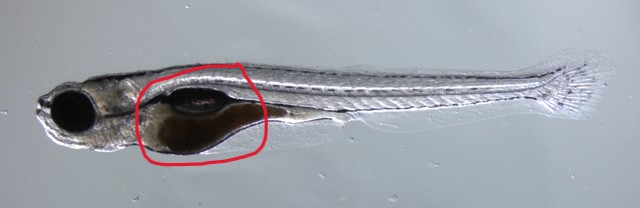

# Présence en laboratoire le 6 juin

## Expérience 1

## But principal
___

Le but de la première expérience de cette journée était de mettre un *zebrafish* juvénile vivant dans l'agarose pour le stabiliser et pouvoir par la suite prendre des images en microscopie HiLo de celui-ci.

## Matériel
___

- Poisson *zebrafish* juvénile se trouvant dans un petit pétri, possiblement avec plusieurs autres *zebrafish*

- Agarose à une température suffisament chaude pour qu'il soit liquide

- Microscope de table

- Pipette transparente avec une ouverture suffisament grande pour laisser passer le poisson

- Seringue ayant pour bout un fil dentaire à la place d'une aiguille, permettant de déplacer le poisson une fois qu'il ait été déposé dans l'agarose sans le blessé

- Bac de glace

- Un petit pétri propre vide

- Eau pour les *zebrafish* contenant des nutriments

## Déroulement
___

Étape $(1)$:

Tout d'abors, il faut aspirer **un seul** poisson se trouvant dans un petit pétri dans notre pipette pour le transférer par la suite dans l'agar. Une fois le poisson dans la pipette, il faut s'assurer qu'il n'y ait pas trop d'eau avec le poisson, sinon, lors du transfert dans l'agar, celui-ci sera trop dilué par l'eau.

Étape $(2)$:

Par la suite, on doit mettre le poisson dans l'agar. Il est **très** important que lors du transfert dans la fiole, l'agar ne soit pas trop chaud. En effet, si la substance est trop chaude le poisson va simplement cuire. On peut alors vérifier sa température en le placant sur son poignet juste en dessous de la paume. Si la température est supportable et quasiment température peau, on peut transférer le poisson dans la fiole d'agar.

Dans le laboratoire, l'agar est normalement maintenue à une température constante sous l'état liquide. Il faut alors s'assurer de diminuer sa température pour pouvoir placer le poisson à l'intérieur et pour que sa température diminue plus rapidement, on peut prendre un bac de glace et placer la fiole dedans environ 10 à 20 secondes.

Étape $(3)$:

Une fois cela fait, il faut rapidement repécher le poisson se trouvant dans l'agar avec la pipette et le placer dans un petit pétri vide que l'on s'était préalablement préparé. De cette manière, le poisson devrait être dans une goute d'agar qui commence à refroidir et donc à ce solidifier sur le pétri. Il faut alors faire vite pour bien placer le poisson avant que l'agar se solidifie.

Il faut s'assurer qu'il soit le plus droit possible, c'est-à-dire qu'il repose dans un seul et même plan $xOy$ sans être en angle par rapport à celui-ci. Pour ce faire, on place le poisson sous le microscope pour bien voir son orientation, et on utilise la seringue pour le déplacer. Pour savoir si le poisson est à l'endroit, on peut y aller visuellement en s'assurant que la petite boule noire sur le corp du poisson soit positionné vers le bas (voir l'image ci-haute). Aussi, il faut que le poisson soit le plus uniformément en focus. Autrement dit, si on sort du focus, le poisson devrait sortir en entier du focus et non seulement ses yeux, par exemple.

Finalement, une fois que le poisson est bien placé, il suffit simplement de rajouter de l'eau à zebrafish contenant certain nutriment pour qu'il puisse respirer et que notre objectif puisse le voir sous l'eau.

## Résultat
___

Le poisson a bien été placé dans l'agar, mais malheureusement, il s'agissait de ma première fois et il était légèrement croche et non directement dans le plan $xOy$. Par contre l'orientation était suffisante pour prendre des images par la suite. 

## Expérience 2

## But principal
___

Le but principal de cette deuxième expérience était de prendre en image le poisson préparé dans la première expérience pour pouvoir commencer à faire des tests de l'algorithme HiLo sur des véritables images de *zebrafish*. Par exemple, nous voulions un stack d'image *speckle*, une série de plusieurs stack d'image uniforme et un même plan pris en image chaque 100ms pour un total de 5000 images.

Les deux premières acquisitions permetterons de faire des tests pour réaliser du sectionnement optique avec le stack speckle et le stack uniforme et la deuxième permettera de tester la correction de mouvement dans le temps.

## Matériel
___

- Un *Zebrafish* préparé comme dans la première expérience 

- Le matériel utilisé pour la prise d'image est tout expliqué dans le guide pour l'utilisation du microscope HiLo disponible [ici](fakelien.com).

- Les fonctions des différents paramètres utilisé dans Nirvana pour prendre les images dans cet expérience sont expliqués [ici](fakelien.com). 

- Tout au long de cet expérience, le code du Arduino qui fut utilisé est celui permettant de faire une loop sur les différentes valeurs de courant de l'ETL permettant une image complète du cerveau. Il est disponible [ici](https://github.com/DCC-Lab/HiLoZebrafish/tree/master/ArduinoCodeForETL) sous le nom de *LoopCommandInHiLoSetup.ino*.

## Méthode
___

Cette expérience sera divisée en 3 étapes distinctes:

- $(1)$ **Premièrement**: La prise des images du stack *speckle*

- $(2)$ **Deuxièmement**: La prise des images des différents stacks uniformes

- $(3)$ **Finalement**: La prise des images du plan fixe en $z$ pendant un certain temps pour cumuler 5000 images.

## Déroulement
___

Étape $(1)$:

- Méthode prise:

  Premièrement, pour prendre les images on s'est assuré de ne pas mettre le diffuseur en marche pour que le mode *speckle* soit activé. Les paramètres choisis dans Nirvana et dans le code du Arduino pour l'expérience sont donnés par la suite. 
  
  Ces paramètres sont choisies pour une raison particulière lors de la prise des images *speckle*. En effet, les images speckles vont chercher les basses fréquences de l'image HiLo finale, alors nous devons premièrement nous assurer de prendre un temps d'exposition suffisament long pour pouvoir capter le plus de photon possible. Ensuite, cette image sera utilisée tout au long de l'expérience, car les basses fréquences sont estimées ne pas varier dans le temps. Nous pouvons alors prendre un bon nombre de plans peu espacé pour bien couvrir le cerveau du poisson avec une bonne résolution spatiale.

  - Taille de l'image: 1024x1024

  - Temps d'exposition: 100ms
 
  - Puissance du laser: 200mW

  - Espacement par images: $5 \mu m$, à sélectionner dans le code arduino

  - Nombre de cycle: 100

  - Nombre d'image par cycle: 1

  - Nombre de temps par cycle: 100ms

- Résultats

  Nous avons alors obtenue de belles images couvrant tout le cerveau du poisson. Par contre, puisque le poisson était croche, les images sont un peu flou et cela apparait bien dans les images. Elles sont disponibles pour visualisation sur le serveur *cafeine3* sous les dossiers suivants:

  - *cafeine3 -> Goliath -> maroy -> HiLo -> 20230606-first_fish_prepared_images -> Clean images -> 20230606-Zebrafish-200mW-Binning2x-100ms-RefSpecklesStack-100im-001*

Étape $(2)$:

- Méthode prise:

  Pour prendre les images on s'est assuré de mettre le diffuseur en marche pour que le mode uniforme soit activé. Les paramètres choisis dans Nirvana et dans le code du Arduino pour l'expérience sont donnés par la suite.

  Cette fois, le but était de faire des stacks volumétriques d'images uniforme du cerveau complet du poisson, mais réaliser plusieurs stacks un à la suite de l'autre pour pouvoir avoir une certaine valeur des intensité du volume entier du cerveau au cours du temps. De cette manière, nous devions avoir un temps d'acquisition plus rapide. Pour ce faire, nous avons pris moins d'images par stack plus espacés. Pour le temps d'exposition, nous avons tester deux différentes valeurs soit 30ms et 100ms, pour voir si l'impact de ces temps d'expositions était important.

  - Taille de l'image: 1024x1024

  - Temps d'exposition: 30ms et 100ms
 
  - Puissance du laser: 200mW

  - Espacement par images: $10 \mu m$, à sélectionner dans le code arduino

  - Nombre de cycle: 20 par stack = 1000 images pour 50 stacks

  - Nombre d'image par cycle: 1

  - Nombre de temps par cycle: 30ms et 100ms

  - Nombre d'image par volume: 20

- Résultats

Nous avons frappé quelques obstacles pour ces prises d'images. Premièrement, il y a un problème dans le code du Arduino qui fait que la première série d'image prise manque certaines images. Ce problème devra être corrigé. Par la suite, nous avons eu une contrainte mécanique. En effet, l'ETL change de focale sous l'action d'une membrane. Cette membrane varie selon le courant qu'elle recoit, mais elle a un temps de réponse fini. De ce fait, la prise d'une des 20 images correspond avec l'ETL qui est en cours de changement de sa membrane. Nous avons donc une image abberante. La bonne nouvelle est que ce problème est constant et arrive chaque fois à la même fréquence. De cette manière, certaines images ne sont pas bonne dans les données finales, mais on peut facilement les retirer. Elles sont disponibles pour visualisation sur le serveur *cafeine3* sous les dossiers suivants:

  - *cafeine3 -> Goliath -> maroy -> HiLo -> 20230606-first_fish_prepared_images -> Clean images -> 20230606-Zebrafish-200mW-Binning2x-ADD THE REST*

Étape $(3)$:

- Méthode prise:

  Pour prendre les images on s'est assuré de mettre le diffuseur en marche pour que le mode uniforme soit activé. Les paramètres choisis dans Nirvana et dans le code du Arduino pour l'expérience sont donnés par la suite.

  Pour cette partie, nous voulions simplement observer l'activité neuronale du poisson au même plan en $z$ pendant un certain nombre de temps. Pour ce faire, il n'était pas nécessaire d'utiliser l'ETL, car le plan reste le même.

  - Taille de l'image: 1024x1024

  - Temps d'exposition: 100ms
 
  - Puissance du laser: 200mW

  - Nombre de cycle: 1

  - Nombre d'image par cycle: 5000

- Résultats

  Les images obtenues sont belles, mais le poisson n'est pas énormément actif durant les images. Il se peut qu'il soit décédé durant sa mise dans l'agar. Par contre, l'algorithme de correction de mouvement pourra tout de même être testé. Ces images sont disponibles pour visualisation sur le serveur *cafeine3* sous les dossiers suivants:

  - *cafeine3 -> Goliath -> maroy -> HiLo -> 20230606-first_fish_prepared_images -> Clean images -> 20230606-Zebrafish-200mW-Binning2x-ADD THE REST*