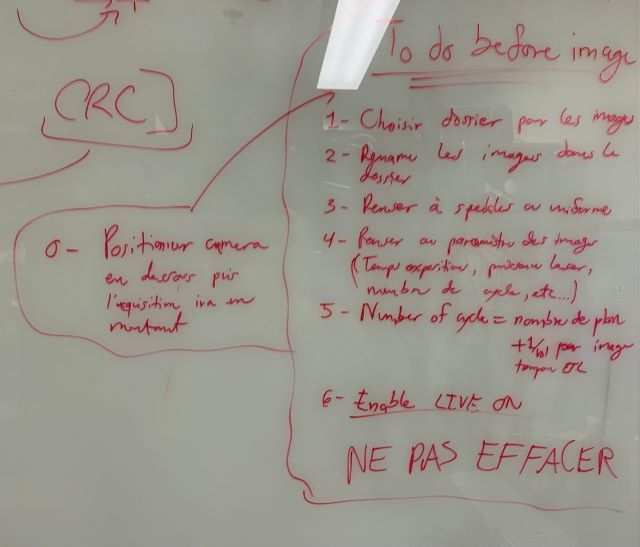

# Présence en laboratoire le 22 juin

La présence en laboratoire de cette journée comportait deux parties: Premièrement, il fallait corriger le code Arduino qui contrôle le changement de focale de l'ETL. Deuxièmement, une fois cela fait, il fallait prendre des images avec l'ETL d'un *zebrafish* vivant pour efficacement tester l'algorithme HiLo.

## Expérience 1

## But principal
___

Le but de cette expérience était de bien configurer le code Arduino pour que, lorsque le *zstack* complet est réalisé, l'effet de changement de membrane de l'ETL soit compensé par la prise d'une image tampon supplémentaire (voir cahier de laboratoire du 20230606). Aussi, il fallait s'assurer que lors de la prise d'image d'une série de *zstack*, chacun ait le même nombre d'image.

## Matériel
___

- Le matériel utilisé pour la prise d'image est tout expliqué dans le guide pour l'utilisation du microscope HiLo disponible [ici](fakelien.com).

- Les fonctions des différents paramètres utilisé dans Nirvana pour prendre les images dans cet expérience sont expliqués [ici](fakelien.com).

- Tout au long de cet expérience, le code du Arduino qui fut utilisé est celui permettant de faire une loop sur les différentes valeurs de courant de l'ETL permettant une image complète du cerveau. Il est disponible [ici](https://github.com/DCC-Lab/HiLoZebrafish/tree/master/ArduinoCodeForETL) sous le nom de *LoopCommandInHiLoSetup.ino*.

- Échantillon de billes fluorescentes qui sont disponibles dans le frigidaire sous le cahier de lame de Valérie (peut importe lequel, il s'agit surtout d'observer de la fluorescence) 

## Déroulement
___

Étape $(1)$:

La première étape consistait à s'assurer que l'effet mécanique de la membrane soit compensé par l'ajout d'une image de plus avant la réelle prise d'image de chaque *zstack*. En effet, lorsque le changement de focale est trop élevé, le temps que prend la membrane de l'ETL pour revenir à sa valeur de courant nulle est plus lent que le temps d'attente entre chaque images. De cette manière, tout les *zstack* devenait décalé puisqu'ils comprenait une image de l'ETL en changement de focale.

Pour un *zstack* de 25 plans par exemple, il s'agit alors seulement de rajouter un compte supplémentaire dans le code pour que le code compte 26 images par *zstack*. Après la prise d'image, on pourrait alors facielement supprimer la première image de chaque *zstack*.

Par contre, il faut aussi s'assurer que cette première image ne soit pas comptabilisé comme étant dans le *zstack* faisant en sorte que la focale change aussi avec cette image tampon. On veut que la première image du *zstack* soit toujours à courant nul et donc à focale initiale. Il suffit alors de rajouter un bout de code indiquant que la focale de l'ETL change seulement après la prise de la première image.

Il faut aussi ne pas oublier d'ajuster le bon nombre de cycle dans l'option *timelapse* de Nirvana. En effet, si on veut faire 10 *zstack* de 25 plans chaque, il ne faudra pas mettre 250 cycles, mais 260 pour comptabiliser l'image tampon de plus par *zstack*.

Étape $(2)$:

Ensuite, dans une acquisiton où l'on prend plusieurs *zstack* de suite, il fallait s'assurer que le nombre d'image prise par chaque *zstack* soit le même. Avant, il n'était pas exactement les même et il y avait une image de plus par *zstack* suivant le premier. Il y avait simplement une petite erreur dans le code qu'il fallait corriger qui ajoutais un plan de plus après chaque *zstack*.

Étape $(3)$:

Le dernier problème vient du fait que lorsque l'on envoye le code au Arduino, il attend un signal *LOW* de la caméra pour se mettre à changer de focale dans la ETL (voir le cahier de laboratoire du 20230505 pour une explication plus détailé d'un signal *LOW*). Le code est alors en marche peut importe si on sauvegarde des images sur l'ordinateur avec le bouton *Acquire image*. De cette manière, le fait d'appuyer sur *Live on* ou *Live off* peut venir comptabiliser un plan dans le code alors que l'on ne veut pas comptabiliser ce plan. On veut que le code fonctionne seulement lorsque l'on *Acquire image*.

Malheureusement, le fix temporaire que l'on à trouvé est de simplement s'assurer que l'on soit en *Live on* avant d'**upload* le code au Arduino et avant d'appuyer sur *Acquire image*. De cette manière, le signal envoyé par la caméra sera constamment *HIGH* et le code attendera un signal sans comptabiliser de faux plans.

## Résultat
___

Les résultats sont très bons et montrent bien que l'on à réussi à obtenir des *zstack* possédant tous le même nombre d'image et aussi possédant une image tampon de plus qui devra être retiré. On peut voir ces résultats dans cafféine sous:

- *cafeine3 -> Goliath -> maroy -> HiLo -> 20230622-TestForEqualETLSteps*

## Expérience 2

## But principal
___

Maintenant que l'ETL fonctionne comme voulu, le but principal de cette deuxième expérience était de prendre en image un poisson préparé dans l'agarose pour pouvoir commencer à faire des tests de l'algorithme HiLo sur des véritables images de *zebrafish*. Nous voulions un stack d'image *speckle* de 200 plans couvrant tout le cerveau du poisson, un stack d'image *uniform* aussi de 200 plans et une série d'image *uniform* de 40 *zstack* de 25 plans chaque permettant d'observer l'activité neuronale du poisson au court du temps.

## Matériel
___

- Poisson *zebrafish* juvénile se trouvant dans un petit pétri, possiblement avec plusieurs autres *zebrafish*

- Agarose à une température suffisament chaude pour qu'il soit liquide

- Microscope de table

- Pipette transparente avec une ouverture suffisament grande pour laisser passer le poisson

- Seringue ayant pour bout un fil dentaire à la place d'une aiguille, permettant de déplacer le poisson une fois qu'il ait été déposé dans l'agarose sans le blessé

- Bac de glace

- Un petit pétri propre vide

- Eau pour les *zebrafish* contenant des nutriments

- Le matériel utilisé pour la prise d'image est tout expliqué dans le guide pour l'utilisation du microscope HiLo disponible [ici](fakelien.com).

- Les fonctions des différents paramètres utilisé dans Nirvana pour prendre les images dans cet expérience sont expliqués [ici](fakelien.com).

- Tout au long de cet expérience, le code du Arduino qui fut utilisé est celui permettant de faire une loop sur les différentes valeurs de courant de l'ETL permettant une image complète du cerveau. Il est disponible [ici](https://github.com/DCC-Lab/HiLoZebrafish/tree/master/ArduinoCodeForETL) sous le nom de *LoopCommandInHiLoSetup.ino*.

## Méthode
___

Cette expérience sera divisée en 2 étapes distinctes:

- $(1)$ **Premièrement**: Le placement du poisson dans l'agarose

- $(2)$ **Deuxièmement**: La prise d'image des différents stacks vouluent

## Déroulement
___

Étape $(1)$:

- Méthode prise:

  La méthode prise est la même qu'expliqué dans le cahier de laboratoire du 20230606. Par contre, il y a quelques changement à apporter permettant un poisson plus fixe et une façon plus facile de bien l'orienter dans l'agarose.

  Tout d'abors, au lieu de prendre le poisson dans l'eau, le transféré dans l'agarose à température correcte et finalement le repécher dans l'agarose pour le déposer dans le pétri, une différente technique a été prise. Il suffit de pécher le poisson dans l'eau, retirer le plus d'eau possible dans la pipette (n'avoir environ qu'une goutte) et le placer directement dans le pétri. De ce fait, il va s'orienter lui même dans l'eau avant le placement de l'agarose. 
  
  Par la suite, on fait baisser la température de l'agarose pour ne pas tuer le poisson et on vient la placer directement sur le poisson dans le pétri. Il faut aussi s'assurer de faire un gros X d'agarose dans le pétri avec le poisson au milieu bien sur. De cette manière, lorsque l'agarose sera sêche, elle solidifiera bien le poisson pour s'assurer qu'il ne bouge pas.

- Résultats

  Le poisson a bien été placé dans l'agarose et l'orientation était belle pour prendre des images par la suite.

Étape $(2)$:

- Méthode prise:

  La méthode de prise d'image est assez similaire à celle que nous avions réalisé dans le cahier de laboratoire 20230606. Tout les trucs à vérifier et ne pas oublier avant l'acquisition ont été resumé dans l'image suivante:

  

  Cette fois, le but était de faire un *zstack* *speckle* et un *zstack* *uniform* de 200 plans anatomique. De cette manière, il fallait s'assurer de bien voir les différentes structures du poisson. On pouvait donc prendre des images avec un temps d'exposition élevé. Les paramètres choisies furent les suivants:

  - *Speckle* et *uniform*:

    - Taille de l'image: 1024x1024

    - Temps d'exposition: 500ms
    
    - Puissance du laser: 15mW

    - Espacement par images: $2 \mu m$, à sélectionner dans le code arduino

    - Nombre de cycle: 200 pour un *zstack*

    - Nombre d'image par cycle: 1

    - Nombre de temps par cycle: 500ms

  Par la suite, on voulait aussi réaliser une prise d'image pour observer l'activité des neurones au cours du temps. De cette manière, nous avons pris une exposition *uniform* plus courte pour s'assurer de faire les *zstack* rapidement. Les paramètres pour l'expérience sont les suivants:

  - *uniform*:

    - Taille de l'image: 1024x1024

    - Temps d'exposition: 25ms
 
    - Puissance du laser: 200mW

    - Espacement par images: $10 \mu m$, à sélectionner dans le code arduino

    - Nombre de cycle: 25 par stack = 1040 images pour 40 stacks et 40 images tampons

    - Nombre d'image par cycle: 1

    - Nombre de temps par cycle: 25ms

    - Nombre d'image par volume: 25

- Résultats

  Malheureusement, j'ai oublié de rajouter les images tampons pour la troisième acquisition. Les images obtenues sont disponibles pour visualisation sur le serveur *cafeine3* sous les dossiers suivants:

  - *cafeine3 -> Goliath -> maroy -> HiLo -> 20230622-ZebrafishWithWorkingETL*